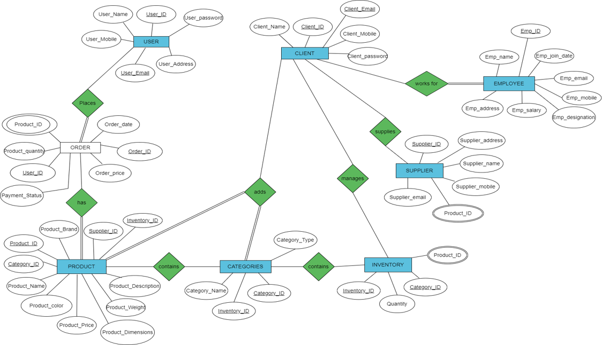
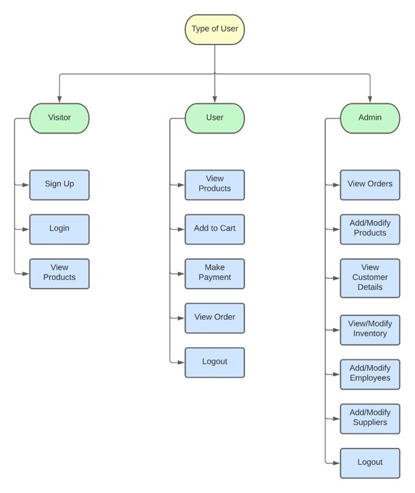
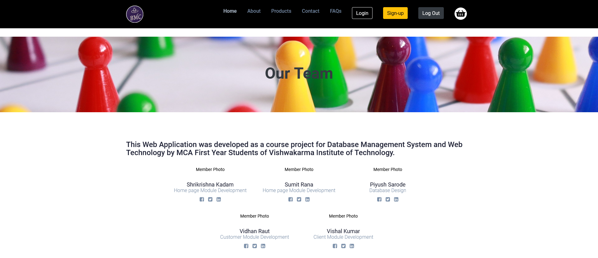
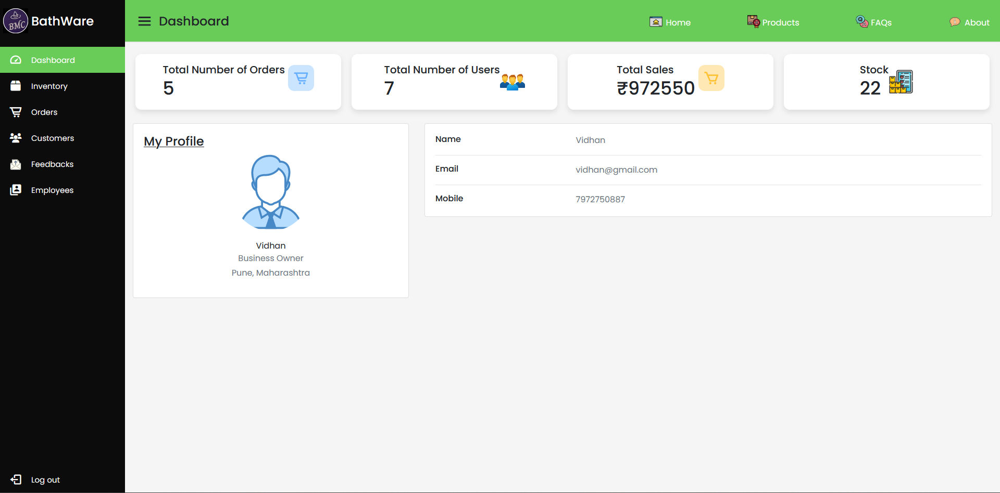
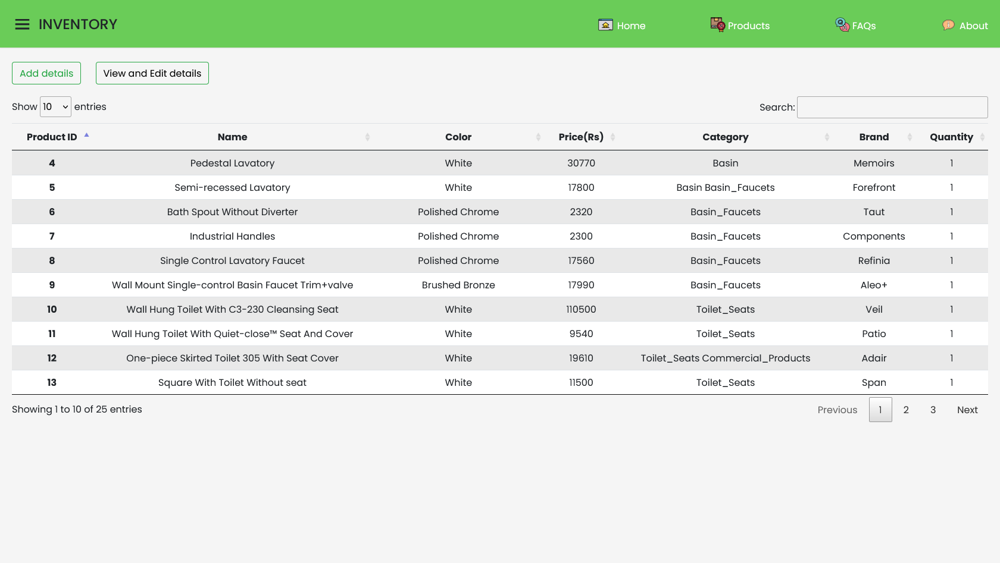
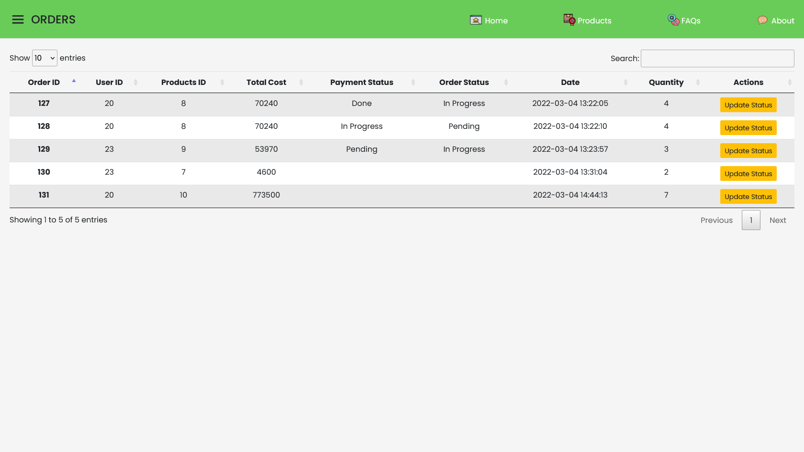

# Hardware (Bathware) Management System

## Aim and Objective

- The goal is to build a web platform for a hardware and sanitary goods store. This will allow the client to take orders from customers all around the world. It also aids in inventory management.
- The objective of this project is to enable the client to accept online orders and manage inventory accordingly.
- Login authentication for both clients and customers are required for security reasons.
- To design and build a web application for keeping record of inventory and stock currently present, and update into the database accordingly.
- It includes:

    - Displaying the available inventory.
    - Accepting customer inputs.
    - Inventory manipulation

## Architecture

- In presentation layer we have used HTML, CSS, Bootstrap.
- And in application layer we used PHP server side-scripting language. This layer fetches and manipulate data present in database.
- MySQL database is used to store all customer details and products.

## Entity Relationship Diagram

## Users

## Demonstration

## Screenshots

 